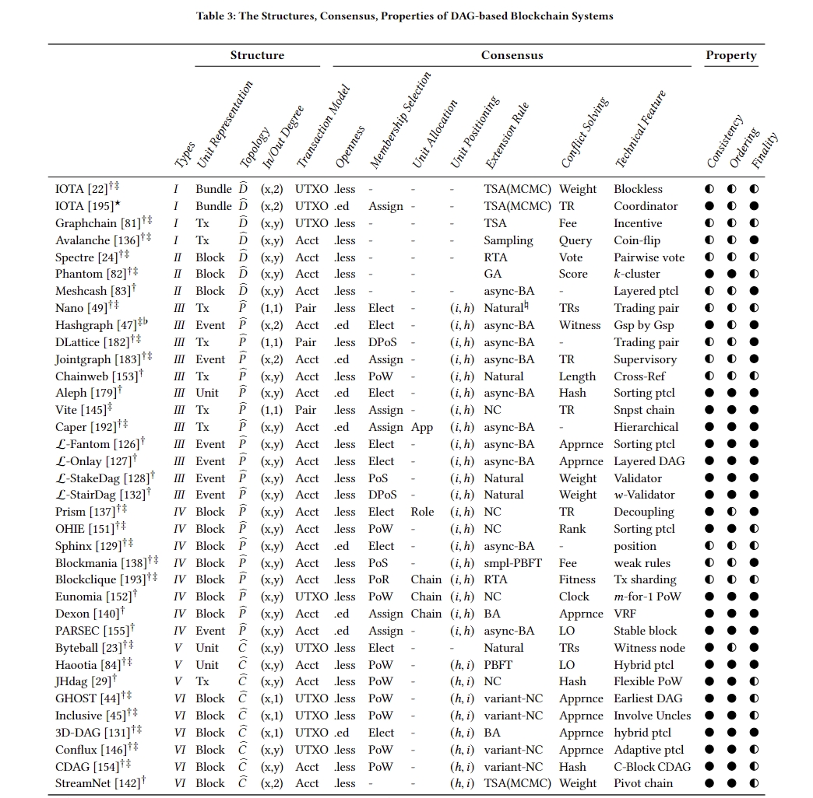
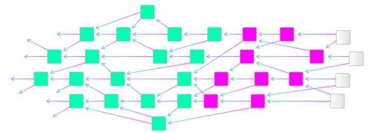
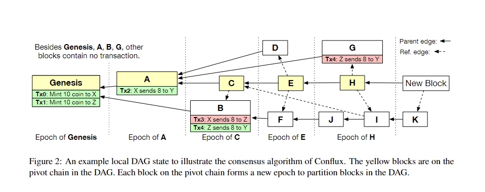

# DAG

## IOTA

1. 构造 POW 结果。发起者需要执行轻量级的工作量证明（PoW），证明他们对整个网络做出了一定的计算贡献。这有助于防止滥用和网络攻击。在IOTA中，PoW的难度相对较低，因此即使是较为简单的设备也能完成。

2. 构造交易。将签名和PoW结果添加到交易数据中，形成一个完整的交易数据包。

### 解决双花

IOTA 为每个交易计算权重(weight)和累计权重(cumulative weight),前者与交易自身 PoW 大小成正相关,后者是自身权重与 DAG 中直接或间接引用自己的所有交易的权重之和.
本质上,累计权重代表了全网对该交易的信任度.当一个交易的累计权重足够高时,它将以极高的概率得到确认.
此外,为了避免节点引用攻击者的双花交易,以及惩罚懒惰节点,IOTA 引入了马可夫蒙特卡洛(Markov chain Monte carol)随机游走算法.
该算法中,节点需要先在 DAG 中随机选取累计权重在 W 与 2W 之间的 N 个点,然后让它们以概率

${p _{xy}} =  \frac{e^{-\alpha(H_x-H_y)}}{\sum_{z} ^xe^{-\alpha(H_x-H_z)}}$

向子交易随机游走,最先到达的两个端交易(tip site)即为需要验证的两个交易.其中,y→x 表示 y 直接引用 x,$\alpha$是一个非负可调参数.
在该公式中,存在引用关系的两个交易之间累计权重相差越小,则子交易为随机游走的下一步的概率越高.
实际情形中,懒惰节点所发布的交易以及攻击者的双花交易所在的子 DAG 中,交易的累计权重往往要比主链中的交易小很多,因此该算法能够有效避免这些交易被后续交易引用.
事实上,除累计权重外,根据马尔可科夫蒙特卡洛随机游走算法也能够判定交易合法性.但实际应用中,两种方式对普通用户来说过于复杂,且在攻击者算力足够高的情况下不能有效抵御双花攻击.
因此在实际运行中 IOTA 引入了一个由基金会运行的协调节点(coordinator)来定期发布检查点以进行交易确认.

## Conflux

Conflux 从区块的总顺序中推导出这些区块内的交易的总顺序，以处理这些交易。对于冲突或重复的交易，Conflux只处理第一个交易，并丢弃其余的交易。

### 解决双花

**父边**：除Genesis外，每个块都有一个向外的父边（图中的实线箭头）。直观地，父边对应于投票关系，即，生成子块的节点对由父块表示的交易历史进行投票。例如，从C到A有一条父边，从F到B有一条父边。

**参考边**：每个块可以有多个向外的参考边（图2中的虚线箭头）。参考边对应于块之间的generatedbefore关系。例如，存在从E到D的参考边。这表明D在E之前生成。

**枢轴链**：请注意，DAG中的所有父边一起形成父树，其中创世块是根。在父树中，Conflux选择一条从创世块到其中一个叶子块的链作为枢轴链。与选择树中最长链的比特币协议不同，Conflux基于GHOST规则选择枢轴链。具体地，选择算法从创世块开始。在每一步，它计算父树中每个子树的子树大小，并前进到具有最大子树的子块，直到它到达叶块。GHOST规则的优点是，它保证了所选枢轴链的不可逆性，即使由于网络延迟而面临诚实节点的分叉，因为分叉中的块也有助于枢轴链的安全性。

选择Genesis、A、C、E和H作为枢轴链。请注意，这不是父树中最长的链，最长的链是Genesis、B、F、J、I和K。Conflux不选择这个最长的链，因为A的子树比B的子树包含更多的块。因此，链选择算法在其第一步选择A而不是B。

**Epoch**：父边、参考边和枢轴链一起使Conflux能够将DAG中的所有块拆分为epoch。如图所示，pivot链中的每个区块对应一个epoch。每个epoch包含所有区块：1）通过父边和参考边的组合从枢轴链中的对应区块可到达的区块，以及2）不包括在先前epoch中的区块。

**交易总顺序**：Conflux首先根据交易所在区块的总顺序对交易进行排序。如果两个交易属于同一个区块，Conflux会根据区块中的出现顺序对两个交易进行排序。

Conflux在导出订单的同时检查交易的冲突。如果两个事务相互冲突，Conflux将丢弃第二个事务。如果一笔交易出现在多个区块中，Conflux只会保留第一次出现的交易，并丢弃所有多余的交易。

在图中，事务总顺序是Tx0、Tx1、Tx2、Tx3、Tx4和Tx4。Conflux丢弃Tx3，因为它与Tx2冲突。实际交易顺序是Tx0、Tx1、Tx2、Tx4。

## 参考链接

[深入研究基于DAG的区块链系统](https://arxiv.org/pdf/2012.06128.pdf)

[将Nakamoto共识扩展到每秒数千笔交易](https://arxiv.org/pdf/1805.03870.pdf)
