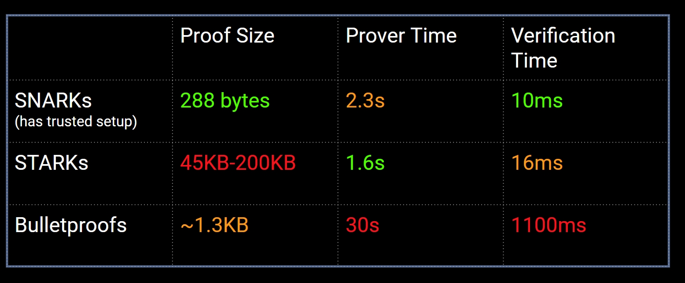
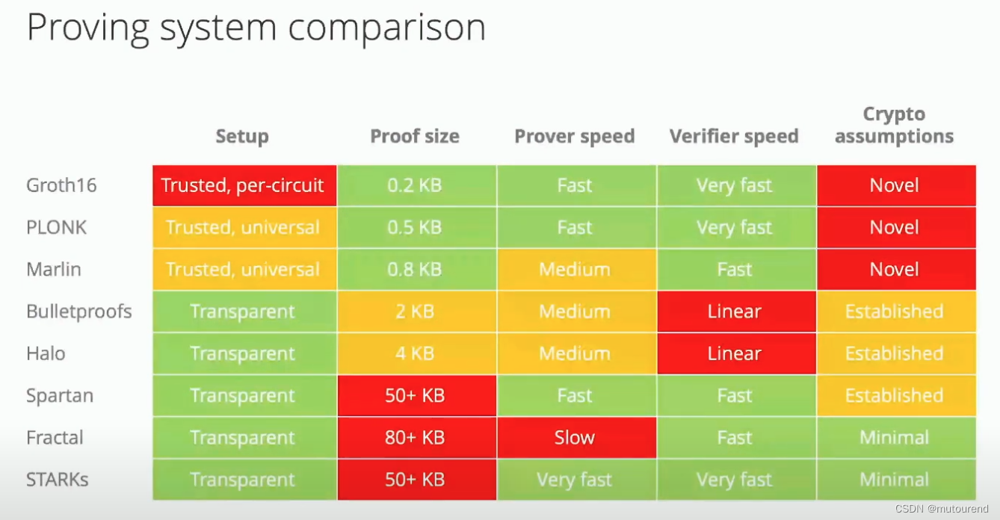
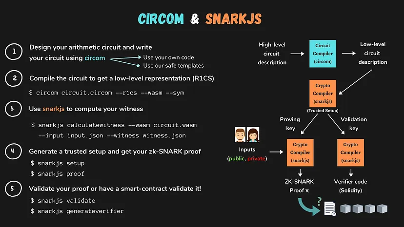
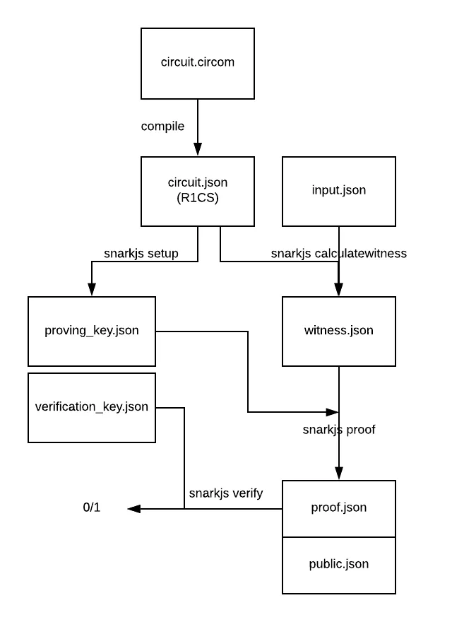
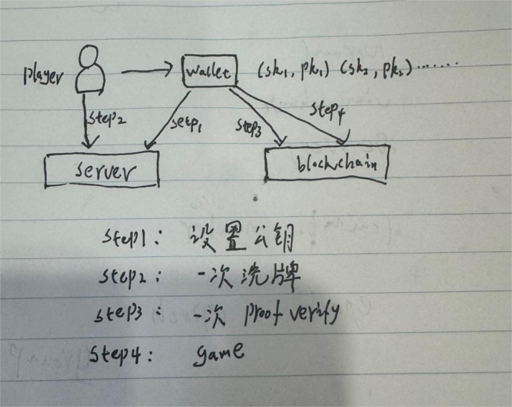

# 信息不对称

证明大小，生成证明和验证时间：

初始设置，信任假设，证明大小：

## 方案一：

此方案类似 zkShuffle，方案成熟稳定已有成熟的代码（https://github.com/Manta-Network/zkShuffle.git）
 
>- zkShuffle 算法论证（https://zkholdem.xyz/wp-content/themes/zkholdem-theme/zkshuffle.pdf）

整体思路：

从现在开发难度上讲，已经有成熟的工具和 DSL 描述语言，用户直接用 DSL 语言编写 zk 约束，由工具生成 zk 验证合约和链下 proof 生成工具。

以太坊预编译合约支持 bn256 相关曲线的操作，主要是 bn256Add(), bn256ScalarMul(), bn256Pairing() 操作。这些操作是验证合约主要用到的基本函数。

snarkjs 工具可以写约束和生成验证合约。

snarkjs 执行步骤：

### 执行步骤

1. 用户公私钥对生成，每个用户生成一个随机秘密秘钥 sk，使用生成器生成公钥 pk。

2. 洗牌：每个用户使用洗牌一次。一个玩家从前一个玩家那里拿走一副牌，然后洗牌加密产生一副新牌。

具体实现（ ElGamal 同态加密， zkSNARK 的典型算法 Groth16）：
 - 链上拿到 前一个玩家洗之后的牌。
 - 对一副牌用随机采样矩阵进行洗牌（变更排列顺序）。
 - 用户 pk 进行同态加密。
 - 对洗牌和加密的有效性用 snarkjs 生成 zk proof（链下输入私有输入生成 proof），链上用 proof 和 洗牌结果，pk 调用验证合约进行验证。

3. 看牌：对于用户的手牌需要每个用户进行一次解密，最终给到最后的卡牌持有者，只有最后的卡牌持有者自己本地可以解密出手牌。

4. 出牌：用户将解密后的卡牌和有效性证明张贴到链上。其他用户可以看牌和证明此牌属于用户。

## 方案二：

此方案需要自己写电路，zk 算法选用 Bulletproof （https://github.com/dalek-cryptography/bulletproofs.git） 效率和安全性（无需 setup）平衡取舍。

因为出块时间限制需要在出块间隔内完成洗牌操作和生成 zk proof，目前 turnNetwork 无法满足时间限制，所以提供链下服务实现洗牌，服务代码开源可信。

且生成的证明放在交易中，会造成交易数据急剧膨胀，综合考虑采用链下生成证明，链上验证的方式。

相对 zkShuffle 改进点：

1. 不需要每一个玩家都在线，不会因为一个玩家掉新而无法继续游戏。
2. 安全性更高，Bulletproof 与 Groth16 相比，无需可信设置。
3. 系统合约实现验证逻辑，绕开 evm，效率高。自主定价，更低的 gas 费用。

### 执行步骤

1. 用户公私钥对生成，每个用户生成一个随机秘密秘钥 sk，使用生成器生成公钥 pk。
2. 每个用户传入自己的公钥给洗牌服务，记录下来公钥方便之后进行加密。
3. 洗牌：zk 生成一次洗牌的 proof。
 - 洗牌次数和用户个数相等，N 个用户 N 次洗牌 N 个 proof（用户调用一次服务洗牌一次，并生成验证交易发送到区块链上验证）。
 - 每一个的洗牌结果都可以放到链上进行验证，避免串谋。
 - 最后一个玩家洗牌之后的结果为最终结果（玩家掉线，不进行洗牌，也无法参与后面的游戏过程）。
4. 看牌：用户本地操作用 sk 解密，即可看到牌面明文。
5. 出牌：用户将自己的牌和 sk 公开，任何一个人可以查看牌面明文。

### 问题

1. 定制证明电路逻辑，工程量比较大，开发难度。
2. 需要一个中心化的洗牌服务，这个服务尽量做到信任假设最小化，洗牌后的结果放在内存中外部无法获取，只是做洗牌操作生成 zk proof，zk proof 链上验证。
3. 单点故障，一个用户掉线之后不影响接下来的流程。具体要多少人在线才能继续游戏，游戏业务方根据业务需要在上层逻辑上做限制。

