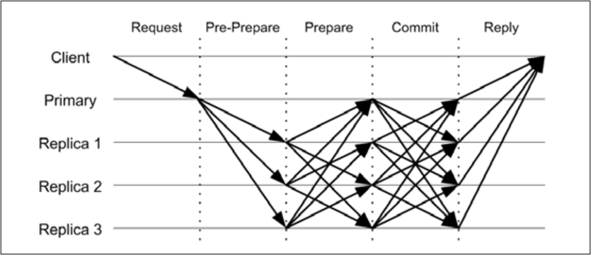
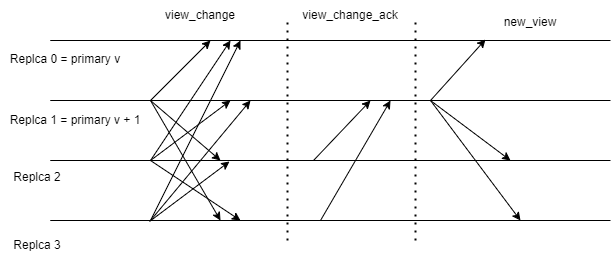
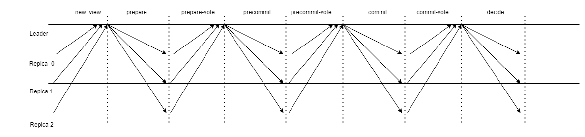
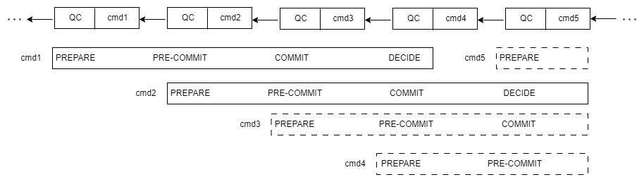
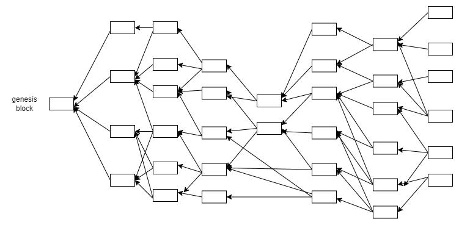
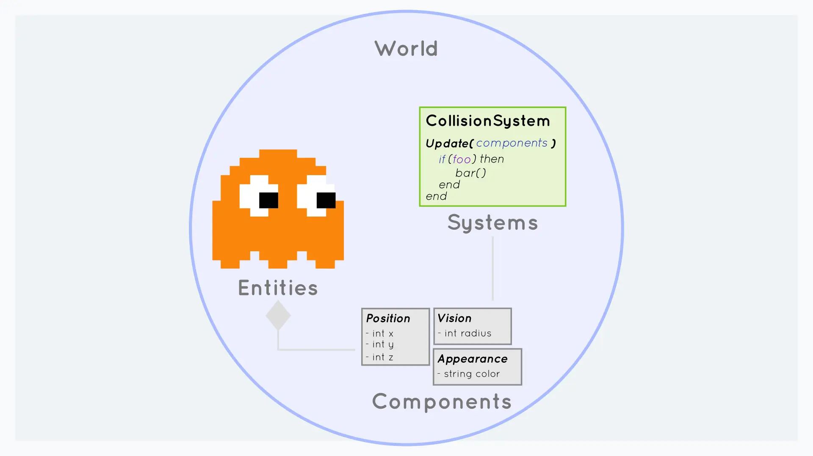

# bubble

bubble 网络是一个支撑全链游戏的，分层区块链网络，针对目前全链游戏的痛点，提出的自己的区块链解决方案。

整体架构分多层实现，layer1 层是一个高性能金融基础设施公链，在去中心化和高性能之间找到 trade-off。

layer2 是一个全民参与挖矿的游戏应用链。

## layer1 金融基础设施公链

### 共识算法

layer1 采用 POS 和 PBFT 的结合，流水线和并行处理提高共识效率。

#### PBFT 状态机复制算法

**normal case protocol**

|  normal case 的消息类型   | 格式  | 补充说明  |
|  ----  | ----  | ----  |
| pre-prepare  | <pre-prepare, view, txn, proof> | 主节点（Primary）广播预准备消息（Preprepare）到各副本节点（Replica）|
| prepare  | <prepare, view, hash(txn)> | 该阶段是各个节点告诉其他节点我已经知道了这个消息，一旦某个节点收到了 包含n-f 个prepare消息（我们将使用QC也就是Quorum Certificate来指代，下同）则进入prepared状态 |
| commit  | <commit, view, hash(txn)> | 该阶段是各个节点以及知道其他节点知道了这个消息，一旦某个节点收到了n-f 个commit消息（QC）则进入committed状态 |

**view change protocol**

|  normal case 的消息类型   | 格式  | 补充说明  |
|  ----  | ----  | ----  |
| view-change  | <view_change, v+1, txn, view-change-proof> | 从节点认为主节点有问题时，会向其它节点发送view-change消息，当前存活的节点编号最小的节点将成为新的主节点 |
| view-change-ack  | <view-change-ack, v+1, (validTxn, validRound), prepare-proof> | 其他节点收到 veiw-change 消息，如果检查 view-change 消息有效，停止低于 v+1 的协议，并回复 ack 给leader |
| new-view  | <pre-prepare, (txn, v+1), ack-proof> | Leader 等待 2f+1 个 ack 消息，并将2f+1 个 ack 消息打包记作 ack-proof，向其他节点广播并开启新的 veiw |

#### bubble 共识协议

**basic protocol**

**Pipelining and Concurrency protocol**

## layer2 全民挖矿游戏应用链

### 共识算法

layer2 是具有生命周期的的应用链，采用更加随机化的 pow 算法和 DAG 结合的共识算法，提高出块的并行性。

pow 共识算法相对于 pos 具有更好的随机性，在 layer2 子网采用 pow 和 DAG 结合可以让每个人参与挖矿获取经济收益。

为解决 pow 共识算法的概率性确认，进一步加上 pos 的混合共识，在 bubble 子网络生命周期结束时进行 pos 加 PBFT 的共识轮进行最终的验证确认。

每个区块有且只有一个父节点边(parent edge),代表一种投票关系,用于共识主链.除此之外,对其他所有前驱区块的引用均为引用边(reference edge),仅用于判定时间先后顺序.如果在 DAG 中去除引用边而只保留父节点边,DAG 将退化成一棵树,此时,采用 GHOST 的最大权重子树原则递归地从这棵树中选举主链.主链确定后,利用主链区块将 DAG 划分为前后相继的轮次,分别对每轮内的所有区块运行拓扑排序算法,最终构成整个 DAG 的区块全序,进而交易全序及冲突交易的合法性也被确定.与主链共识算法相对应地,每个节点在产生新区块时会用父节点边引用视图中的主链端区块(入度为 0 的区块),如同比特币中矿工延长最长链一样,起到主链投票的作用;而主链端区块之外的所有其他端区块,均采用引用边进行引用,以促使 DAG 收敛并用于拓扑排序. 

### 游戏应用链

游戏开发引擎已经从面向对象 OOP （Object Oriented Programming） 的架构转变为更为流行的 ECS 架构（Entity Component System）。

行业痛点：

1. 链上游戏中所有的逻辑都在智能合约中运行，玩家需为游戏中每一次操作进行签署交易确认，形成签名轰炸现象。
2. ESC 操作修改状态调用在 EVM 里面操作，执行速度较慢，消耗计算资源造成gas费用高。
3. 目前区块链底层机制不支持游戏循环，可以通过外部 oracle 触发循环，但是费用较高。

优势：

bubble layer2 应用链提供插件钱包，利用插件中存储临时私钥，实现代签和代扣。

bubble 拥有完全自定义的layer2层应用链，兼容 EVM 同时提供 ECS 状态修改和游戏周期控制相关预编译合约，不用受限与 solidity 语言和 EVM 性能限制。

大量的游戏定制化预编译合约，解决全链游戏痛点。

### 信息不对称

