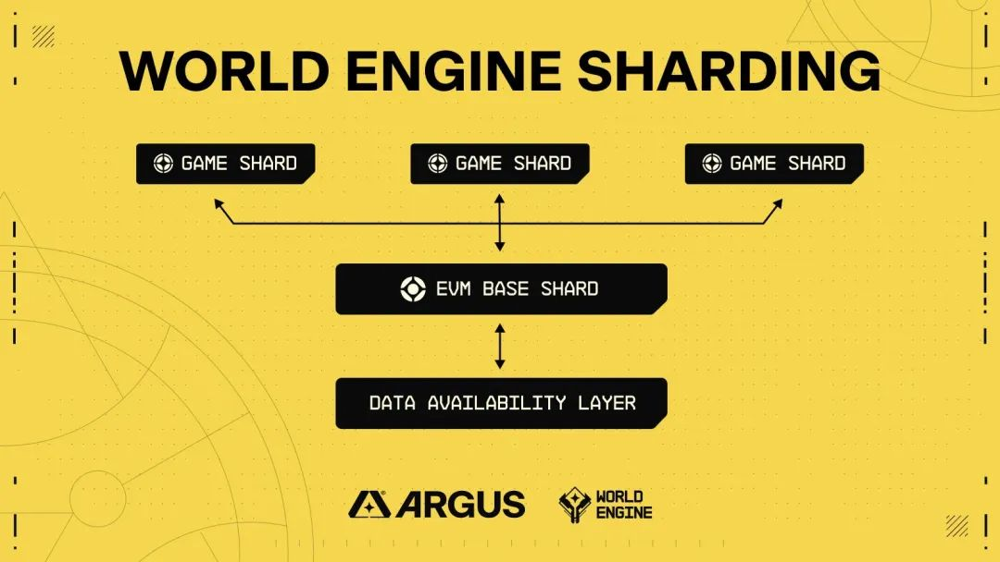

# 游戏二层

op Stack 的 World Engine

## World Engine

World Engine 是一个分片的 Layer2 区块链 SDK。

分片设计是 World Engine 的一大创新，能够使游戏开发者能够将其游戏负载分布到不同的分片上，其灵感来自计算密集型大型多人在线（MMO）游戏的服务器架构。

一条 World Engine 链可以根据需求调整其吞吐量，与开发商或发行商同步增长。

World Engine的分片架构也避免了通过启动另一个单独的 rollup 来扩展时所带来的互操作性/平台碎片化问题。

World Engine 的分片架构可以避免互操作性和平台碎片化问题，以及允许游戏执行（游戏分片）与智能合约执行（EVM 分片）分离，在保持高吞吐量游戏服务器性能的同时，保持区块链的互操作性能力。

World Engine EVM 基础分片为玩家和开发者提供了一个中心场所来构建用户生成内容和平台，这些内容和平台可以通过 Argus Labs 分片路由器系统与游戏分片无缝互操作。

EVM 分片的功能类似于 EVM Rollup，允许像使用以太坊一样使用所有开发人员工具、钱包和库，还借助 Berachain 开发的高性能模块化 EVM 框架 Polaris 通过其状态预编译和插件系统进行定制。

Berachain 开发的高性能模块化 EVM 框架 Polaris，World Engine的 EVM 分片可以通过其有状态的预编译和插件系统进行富有表现力的定制，进而实现一些实用的功能，如为用户补贴 gas，甚至完成一些疯狂的设想，比如将智能合约进行游戏化部署。

Cardinal 是一个高性能的游戏分片，能够处理性能密集型游戏的工作负载。Cardinal 的实体-组件-系统（ECS）架构为之前没有加密游戏开发经验的开发者提供了一个熟悉的开发环境。

Cardinal 可以通过客户端库与现有的游戏引擎（如 Unity 和 Unreal）无缝集成；不再需要处理复杂的区块链集成问题。

### world-cli

world-cli 工具用于创建、管理和部署 Cardinal 游戏分片项目。

```shell
world-cli cardinal create [directory] //Create a World Engine game shard based on https://github.com/Argus-Labs/starter-game-template.

world-cli cardinal start ... // start the following Docker services: Cardinal (Core game logic), Nakama (Relay)
```

### starter-game-template 

游戏模版，使用 Cardinal 和 Nakama 作为帐户抽象和交易中继器构建的示例游戏分片。

集成了 Cardinal 源码。

```shell
├── component
│   ├── health.go
│   └── player.go
├── config.go
├── Dockerfile
├── game
│   └── constants.go
├── go.mod
├── go.sum
├── main.go
├── query
│   └── constant.go
├── system
│   ├── system_attack.go
│   ├── system_player_spawner.go
│   └── system_regen.go
├── tx
│   ├── tx_attack_player.go
│   └── tx_create_player.go
└── utils
    └── world.go
```

实质依赖 world-engine

```
pkg.world.dev/world-engine/cardinal v0.1.48-alpha.0.20231108182349-d63eaaae7de1
pkg.world.dev/world-engine/chain v0.1.12-alpha // indirect
pkg.world.dev/world-engine/rift v0.0.5 // indirect
pkg.world.dev/world-engine/sign v0.1.10-alpha // indirect
```
### world-engine

汇总通过一个特殊的 gRPC 服务器进行扩展，游戏分片可以连接到该服务器，以便向基本分片提交和存储交易。

汇总服务用 cosmos SDK 实现的链。

### 可配置的 tick rate

Cardinal 的实体-组件-系统（ECS）架构


cardinal 游戏分片中，会有可配置定时器 `w.implWorld.StartGameLoop(context.Background(), w.tickChannel, w.tickDoneChannel)`  启动定时任务。

```
func (w *World) Tick(_ context.Context) error {
	nullSystemName := "No system is running."
	nameOfCurrentRunningSystem := nullSystemName
	defer func() {
		if panicValue := recover(); panicValue != nil {
			w.Logger.Error().Msgf("Tick: %d, Current running system: %s", w.tick, nameOfCurrentRunningSystem)
			panic(panicValue)
		}
	}()
	startTime := time.Now()
	tickAsString := strconv.FormatUint(w.tick, 10)
	w.Logger.Info().Str("tick", tickAsString).Msg("Tick started")
	if !w.stateIsLoaded {
		return errors.New("must load state before first tick")
	}
	txQueue := w.txQueue.CopyTransactions()

	if err := w.TickStore().StartNextTick(w.registeredTransactions, txQueue); err != nil {
		return err
	}

	for i, sys := range w.systems {
		nameOfCurrentRunningSystem = w.systemNames[i]
		wCtx := NewWorldContextForTick(w, txQueue, w.systemLoggers[i])
		err := sys(wCtx)
		nameOfCurrentRunningSystem = nullSystemName
		if err != nil {
			return err
		}
	}
	if w.eventHub != nil {
		// world can be optionally loaded with or without an eventHub. If there is one, on every tick it must flush events.
		w.eventHub.FlushEvents()
	}
	if err := w.TickStore().FinalizeTick(); err != nil {
		return err
	}
	w.setEvmResults(txQueue.GetEVMTxs())
	w.tick++
	w.receiptHistory.NextTick()
	elapsedTime := time.Since(startTime)

	var logEvent *zerolog.Event
	message := "tick ended"
	if elapsedTime > warningThreshold {
		logEvent = w.Logger.Warn()
		message += fmt.Sprintf(", (warning: tick exceeded %dms)", warningThreshold.Milliseconds())
	} else {
		logEvent = w.Logger.Info()
	}
	logEvent.
		Int("tick_execution_time", int(elapsedTime.Milliseconds())).
		Str("tick", tickAsString).
		Msg(message)
	return nil
}
```

### 执行分片



共享定序器在打包区块时，将交易路由到对应的分区（namespace）

```go
func (app *App) FinalizeBlockHook(ctx sdk.Context, _ *types.RequestFinalizeBlock) error {
	app.Logger().Info("running finalize block")
	txs := app.ShardSequencer.FlushMessages()
	if len(txs) > 0 {
		app.Logger().Info("flushed messages from game shard. Executing...")
		handler := app.MsgServiceRouter().Handler(txs[0])
		for _, tx := range txs {
			_, err := handler(ctx, tx)
			if err != nil {
				return err
			}
		}
	}
	return nil
}
```

```sol
interface IRouter {
    function sendMessage(bytes memory message, string memory messageID, string memory namespace) external returns (bool);

    function messageResult(string memory txHash) external returns (bytes memory, string memory, uint32);

    function query(bytes memory request, string memory resource, string memory namespace)
        external
        returns (bytes memory);
}
```

预编译合约 `world_engine_router` 实现了 router.sol 合约方法 `SendMessage, MessageResult, Query`

``` go
func (c *Contract) SendMessage(
	ctx context.Context,
	message []byte,
	messageID string,
	namespace string,
) (bool, error) {
	pCtx := vm.UnwrapPolarContext(ctx)

    // 根据 namespace 获取对应的客户端发送消息到对应的分区执行
	err := c.rtr.SendMessage(ctx, namespace, pCtx.MsgSender().String(), messageID, message)
	if err != nil {
		return false, err
	}
	return true, nil
}
```