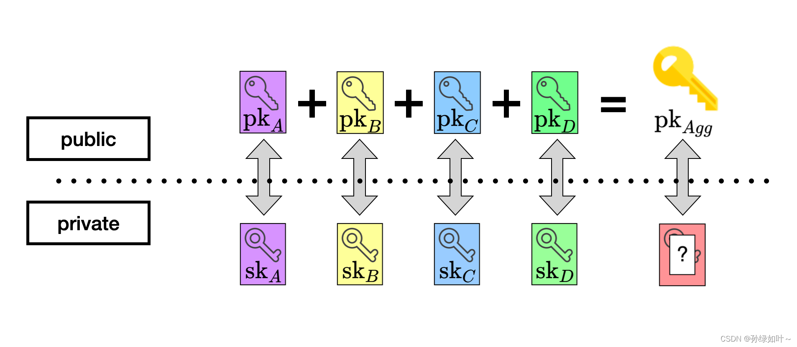
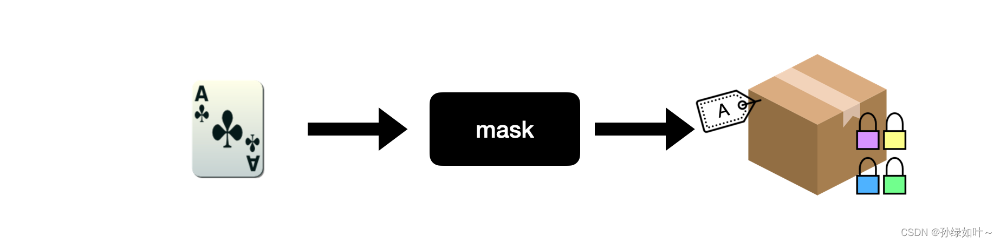
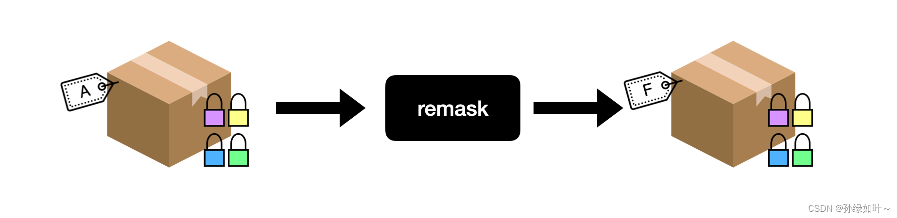
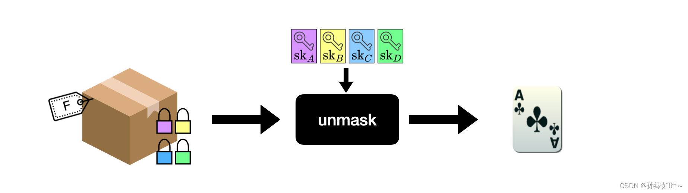
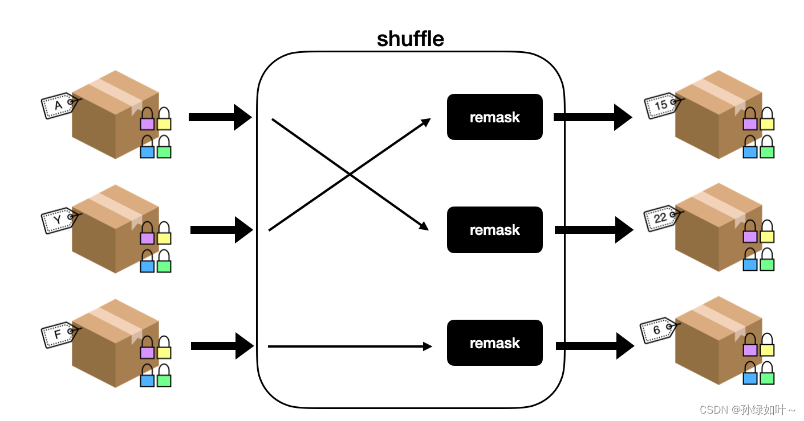

<!-- START doctoc generated TOC please keep comment here to allow auto update -->
<!-- DON'T EDIT THIS SECTION, INSTEAD RE-RUN doctoc TO UPDATE -->

- [zk shuffle](#zk-shuffle)
  - [Geometry Mental Poker](#geometry-mental-poker)
    - [key generation](#key-generation)
    - [mask](#mask)
    - [remask](#remask)
    - [unmask](#unmask)
    - [shuffle](#shuffle)
  - [zkholdem](#zkholdem)
    - [setup](#setup)
    - [shuffle_encrypt](#shuffle_encrypt)
    - [decrypt](#decrypt)
    - [decrypt_post](#decrypt_post)
  - [conclusion](#conclusion)

<!-- END doctoc generated TOC please keep comment here to allow auto update -->

# zk shuffle

## Geometry Mental Poker

Geometry 主要参考了Barnett和Smart在2003年发表的 [Mental Poker Revisited](https://archive.cone.informatik.uni-freiburg.de/teaching/teamprojekt/dog-w10/literature/mentalpoker-revisited.pdf) 一文中的协议。

Barnett-Smart 协议主要依赖两种抽象的密码学概念。第一种抽象是对卡牌的操作使用可验证的门限掩码函数(verifiable -out-of- threshold masking functions)，掩码，可验证，门限, 第二种抽象是使用零知识证明进行洗牌。

Barnett-Smart 协议掩码函数使用了El Gamal加密方案的门限变种算法，这个算法可以在椭圆曲线上实现，不仅可以提高安全性，还能简洁表示卡牌信息。

Barnett-Smart 协议中的洗牌算法时至今日已经过时，但今天有更高效的零知识证明算法可以代替，这也是Geometry的主要改进点。

[Mental Poker Geometry 实现代码](https://github.com/geometryresearch/mental-poker)

### key generation

每个玩家都需要运行这个算法去生成公私钥对。对于玩家A，其公私钥对表示为 $(pk_A, sk_A)$。每个玩家需要将公钥公开，且同时伴随公开一个零知识证明(证明拥有对应的私钥)，如可以使用[schnorr身份证明](https://www.zkdocs.com/docs/zkdocs/zero-knowledge-protocols/schnorr/)，这个证明主要用来抵抗 denial-of-service attacks and rogue key attacks。

```rust
pub fn new<R: Rng>(rng: &mut R, pp: &CardParameters, name: &Vec<u8>) -> anyhow::Result<Self> {
    let (pk, sk) = CardProtocol::player_keygen(rng, pp)?;
    let proof_key = CardProtocol::prove_key_ownership(rng, pp, &pk, &sk, name)?;
    Ok(Self {
        name: name.clone(),
        sk,
        pk,
        proof_key,
        cards: vec![],
        opened_cards: vec![],
    })
}
```

一旦所有玩家公开了他们的公钥，我们可以生成一个聚合公钥$pk_agg$, 只要有一个玩家保密且不泄漏私钥，那么我们就算不出来这个聚合公钥对应的私钥。

```rust
fn compute_aggregate_key<B: ToBytes>(
    pp: &Self::Parameters,
    player_keys_proof_info: &Vec<(Self::PlayerPublicKey, Self::ZKProofKeyOwnership, B)>,
) -> Result<Self::AggregatePublicKey, CardProtocolError> {
    let zero = Self::PlayerPublicKey::zero();

    let mut acc = zero;
    for (pk, proof, player_public_info) in player_keys_proof_info {
        Self::verify_key_ownership(pp, pk, player_public_info, proof)?;
        acc = acc + *pk;
    }

    Ok(acc)
}

// 生成聚合公钥
let joint_pk = CardProtocol::compute_aggregate_key(&parameters, &key_proof_info)?;
```



### mask

掩码即加密操作。利用明文卡牌、聚合公钥和 随机因子生成掩码卡牌(masked card)，这其实是用聚合公钥去加密明文卡牌得到掩码卡牌，要恢复明文卡牌，必须去解密掩码卡牌，但这个过程需要所有玩家配合行动，因为每个玩家都掌握了聚合公钥对应私钥的一份子。

单纯的掩码操作并不能保证游戏的公平性。因为执行掩码操作的玩家知道卡牌值到盒子标签的映射关系。在上面的例子中，梅花A映射到标签“A”。为了打破这种映射关系，需要引入了重掩码（remask）操作。

```rust
fn mask<R: Rng>(
    rng: &mut R,
    pp: &Self::Parameters,
    shared_key: &Self::AggregatePublicKey,
    original_card: &Self::Card,
    r: &Self::Scalar,
) -> Result<(Self::MaskedCard, Self::ZKProofMasking), CardProtocolError> {
    let masked_card = original_card.mask(&pp.enc_parameters, shared_key, r)?;
    let gen = pp.enc_parameters.generator;

    // Map to Chaum-Pedersen parameters
    let cp_parameters = chaum_pedersen_dl_equality::Parameters::new(&gen, shared_key);

    // Map to Chaum-Pedersen statement
    let minus_one = -Self::Scalar::one();
    let negative_original = original_card.0.mul(minus_one).into_affine();
    let statement_cipher = masked_card.1 + negative_original;
    let cp_statement =
        chaum_pedersen_dl_equality::Statement::new(&masked_card.0, &statement_cipher);

    let mut fs_rng = FiatShamirRng::<Blake2s>::from_seed(&to_bytes![MASKING_RNG_SEED]?);
    let proof = chaum_pedersen_dl_equality::DLEquality::prove(
        rng,
        &cp_parameters,
        &cp_statement,
        r,
        &mut fs_rng,
    )?;

    Ok((masked_card, proof))
}
```



### remask

重掩码即对掩码卡牌再次加密，生成一个新的掩码卡牌。这个操作不需要解密密文，因此可以由任何玩家执行。按照此前的模型，重掩码操作就像是替换盒子上的标签。

``` rust
fn shuffle_and_remask<R: Rng>(
    rng: &mut R,
    pp: &Self::Parameters,
    shared_key: &Self::AggregatePublicKey,
    deck: &Vec<Self::MaskedCard>,
    masking_factors: &Vec<Self::Scalar>,
    permutation: &Permutation,
) -> Result<(Vec<Self::MaskedCard>, Self::ZKProofShuffle), CardProtocolError> {
    let permuted_deck = permutation.permute_array(&deck);
    let masked_shuffled = permuted_deck
        .iter()
        .zip(masking_factors.iter())
        .map(|(masked_card, masking_factor)| {
            masked_card.remask(&pp.enc_parameters, &shared_key, masking_factor)
        })
        .collect::<Result<Vec<_>, CardProtocolError>>()?;

    let shuffle_parameters = shuffle::Parameters::new(
        &pp.enc_parameters,
        shared_key,
        &pp.commit_parameters,
        &pp.generator,
    );

    let shuffle_statement = shuffle::Statement::new(deck, &masked_shuffled, pp.m, pp.n);

    let witness = shuffle::Witness::new(permutation, masking_factors);

    let mut fs_rng = FiatShamirRng::<Blake2s>::from_seed(&to_bytes![SHUFFLE_RNG_SEED]?);
    let proof = shuffle::ShuffleArgument::prove(
        rng,
        &shuffle_parameters,
        &shuffle_statement,
        &witness,
        &mut fs_rng,
    )?;

    Ok((masked_shuffled, proof))
}
```



### unmask

去掩码是一种门限解密，每个玩家都必须贡献他们的私钥去解密。例如玩家A、B和C依次执行去掩码操作，最终的密文让玩家D单独解密，那么玩家D解密卡牌后是唯一知道卡牌值的人。

```rust
 let andrija_rt_0 = andrija.compute_reveal_token(rng, &parameters, &deck[0])?;
 let kobi_rt_0 = kobi.compute_reveal_token(rng, &parameters, &deck[0])?;
 let nico_rt_0 = nico.compute_reveal_token(rng, &parameters, &deck[0])?;
 let tom_rt_0 = tom.compute_reveal_token(rng, &parameters, &deck[0])?;
 let rt_0 = vec![andrija_rt_0, kobi_rt_0, nico_rt_0, tom_rt_0];
 let andrija_card = open_card(&parameters, &rt_0, &card_mapping, &deck[0])?;

pub fn open_card(
    parameters: &CardParameters,
    reveal_tokens: &Vec<(RevealToken, RevealProof, PublicKey)>,
    card_mappings: &HashMap<Card, ClassicPlayingCard>,
    card: &MaskedCard,
) -> Result<ClassicPlayingCard, anyhow::Error> {
    let unmasked_card = CardProtocol::unmask(&parameters, reveal_tokens, card)?;
    let opened_card = card_mappings.get(&unmasked_card);
    let opened_card = opened_card.ok_or(GameErrors::InvalidCard)?;

    Ok(*opened_card)
}
```



### shuffle

洗牌是通过改变掩码卡牌的顺序并重新进行掩码来实现的。因为每张掩码卡牌都是唯一可识别的（与现实中卡牌大大不同），仅仅改变掩码卡牌的顺序不会隐藏任何信息，因此执行重新掩码操作才会达到真正的洗牌效果。

Barnett-Smart协议使用零知识证明来证明这个操作被正确执行。

``` rust
let permutation = Permutation::new(rng, m * n);
let masking_factors: Vec<Scalar> = sample_vector(rng, m * n);

let (n_shuffled_deck, n_shuffle_proof) = CardProtocol::shuffle_and_remask(
    rng,
    &parameters,
    &joint_pk,
    &k_shuffled_deck,
    &masking_factors,
    &permutation,
)?;

//3.b Everyone checks
CardProtocol::verify_shuffle(
    &parameters,
    &joint_pk,
    &k_shuffled_deck,
    &n_shuffled_deck,
    &n_shuffle_proof,
)?;
```




## zkholdem

从技术上讲，这个设计仍然遵循巴内特和Smart的设计（也是Geometry使用的设计），不同之处在于我们使用Groth 16 实现了新的shuffle参数。这将每次洗牌和解密的成本降低到链上验证的恒定成本（因此也可以扩展到更多玩家）。

[ZKShuffle: Mental Poker on SNARK for Ethereum](https://zkholdem.xyz/wp-content/themes/zkholdem-theme/zkshuffle.pdf)。

每个玩家都需要加入洗牌，我们不想相信任何人。在第一个玩家之后，每个玩家只洗牌加密的卡片组。基本上每个玩家都对最后一副牌的随机性有贡献，除非所有玩家串通，否则洗牌是公平的。

由于加密和解密的顺序与最终的加密/解密结果无关，因此需要同态加密。

[zkShuffle encryption and decryption circuits](https://www.npmjs.com/package/@zk-shuffle/circuits?activeTab=code)


### setup

心理扑克方案提供了一个生成器 $g：G$, 每个参与者 $p_i$ 生成一个随机秘钥 $sk_i$，使用生成器生成公钥 $pk_i$。 

生成算法：
$$pk_i=sk_i.g$$

聚合公钥生成算法：
$$pk=(sk_1+...+sk_k).g$$

### shuffle_encrypt

每个玩家都需要轮流调用shuffle_encrypt。$C_i$ 表示玩家洗之前的一副牌，$C_i+1$ 表示玩家洗之后的牌，$A$ 随机采样置换矩阵，$R_i$ 随机数组。

洗牌算法：
$$C_{i+1}=ElGamal(pk, g, A.C_i, R_i)$$

利用ElGamal的同态性质，shuffle_encrypt的一个很好的性质是，加密的顺序与结果无关！在洗牌和加密后，给出了生成的牌组，并对洗牌和加密的有效性生成了链上的零知识证明。

### decrypt

一个玩家 $p_i$ 拿出一组加密的卡牌，进行一轮解密。

### decrypt_post

一个玩家 $p_i$ 拿出一组加密的卡牌调用 decrypt 解密，解密后，玩家将解密后的卡片以及解密的有效性证明张贴在链上。

## conclusion

zkholdem 可以理解成 Geometry Mental Poker 区块链上的实现，主要依据为：

在对现有协议中改进的最后一个方面是可以利用分布式账本和智能合约技术。Barnett-Smart协议要求“所有玩家之间有一个广播通道”。智能合约可以被视为这种广播通道的扩展，其中通道本身可以执行一些计算。

在这种情况下，可以将所有的证明验证委托给智能合约，而不是每个玩家都对每个证明运行一个验证器，我们只需要对每个证明进行一次验证。

智能合约的代码是公开的，只要玩家愿意，都可以对其进行审计，当然极其不信任的玩家仍然可以选择自己验证。

<script type="text/javascript" src="http://cdn.mathjax.org/mathjax/latest/MathJax.js?config=TeX-AMS-MML_HTMLorMML"></script>
<script type="text/x-mathjax-config">
  MathJax.Hub.Config({ tex2jax: {inlineMath: [['$', '$']]}, messageStyle: "none" });
</script>
